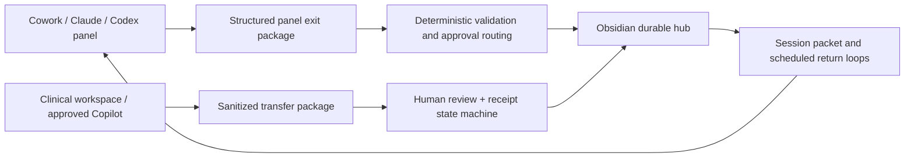

# ACE Final Design

## Architecture summary

> Cowork-panel-first, Obsidian-hub-centered, loop-backed, skill-wrapped, plugin-light, agent-optional.

ACE is a federated system with two application layers and a reviewed bridge.

## ACE-P - personal desktop layer

### Primary work surface

Scoped Cowork, Claude, Codex, or similar panels.

Panels perform:

- curation and triage;
- research;
- analysis and building;
- project review;
- literature processing;
- drafting;
- evidence checking;
- handoff preparation.

Panels do not own durable state. They produce structured exit packages.

### Durable hub

Obsidian provides:

- human inspection;
- review and correction;
- cross-project thinking;
- pending panel updates;
- current project state;
- commitments and return dates;
- evidence and publication records;
- handoff state;
- weekly and strategic reviews.

Obsidian is not required to launch every work session and should not become an open-ended dashboard-building project. Do not add dashboards without replacing an existing surface and demonstrating reduced burden *(carried from codex.md's hub contract, v1.1 — codex.md is the predecessor contract, not included in the public release)*.

### Continuity layer

Deterministic loops manage:

- state transitions;
- scheduled returns;
- stale and overdue detection;
- panel-package validation;
- pending hub updates;
- receipts;
- audit history;
- generated briefs;
- resume packets.

### Portable state

- Markdown or another inspectable text format;
- small JSON/YAML packages;
- Git history;
- replaceable agent and UI integrations.

## ACE-C - clinical workspace layer

ACE-C is minimal by design.

### Clinical surfaces

1. Clinical Today
2. Clinical Action Register
3. Handoff or Review-Panel Package
4. Sanitized Contribution Export

### Clinical loops

- urgent and safety triage;
- routine clinical duty tracking;
- email/meeting/calendar action extraction;
- leadership-visible concern handling;
- internal handoff;
- review-panel updates;
- closure evidence;
- sanitized contribution export.

### Boundary

Clinical tools may see email, meetings, and calendar while missing working folders. Clinical outputs must state source scope and missing locations. The personal repository receives no PHI or unrestricted clinical content.

## Bridge between layers

The two layers do not share a global brain.

They exchange minimum-necessary packages with:

- source scope;
- missing context;
- sensitivity;
- redaction check;
- human approval;
- import acknowledgment;
- expiration;
- closure receipt.

## Panel architecture

### Panel types

| Type | Purpose | Stop condition |
|---|---|---|
| Explore | Map options and evidence | Options, evidence, and gaps documented; **no project auto-created** |
| Decide | Resolve a bounded choice | Decision recorded, or explicitly deferred **with a trigger** |
| Produce | Create a named artifact | Artifact exists and acceptance criteria checked |
| Review | Evaluate work | Pass, revise, reject, or escalate — supported by evidence |

*(v1.1: stop conditions aligned to the fuller `codex.md` variants; the v1.0 table was the abbreviated rendering.)*

### Panel start contract

Every panel receives:

- objective;
- panel type;
- selected roots;
- workspace map;
- authoritative files;
- known missing context;
- previous resume packet;
- expected output;
- write boundary;
- outbox destination.

### Panel exit contract

Every consequential panel produces:

- outcome;
- evidence created;
- proposed state changes;
- commitments detected;
- unresolved items;
- exact next action;
- resume context;
- sources seen and unseen;
- confidence;
- hub destination.

## Obsidian hub surfaces

The hub should remain limited to six stable views:

1. **Today** - narrow execution view.
2. **Pending Panel Updates** - proposed changes awaiting review.
3. **Active Work** - outcomes, next evidence, decision locks, and resume state.
4. **Commitments and Return** - promises, waiting items, and no-action-until dates.
5. **Evidence and Handoffs** - shipped outputs, publication, adoption, and ownership transfer.
6. **Weekly Review** - reliability, conversion, coordination displacement, and one simplification decision.

Each project must display one hub synchronization state:

- `current`;
- `panel_update_awaiting_review`;
- `known_stale`;
- `completeness_unknown`.

## Workspace localization

ACE assumes poor file names, nested folders, and incomplete agent access.

It uses:

- stable project IDs;
- aliases;
- workspace manifests;
- authoritative-file declarations;
- known misleading names;
- selected roots;
- last-verified dates.

Mass renaming is not a prerequisite.

The concrete instantiation of this section is `spec/08_WORKSPACE_ATLAS.md` *(v1.1)* — the researched map of every root ACE may see, with per-root access classes, authoritative files, misleading names, staleness caveats, and privacy exclusion zones. Workspace manifests are generated from the atlas, never from a live filesystem crawl.

## Coexistence with existing automation *(added v1.1 — evidence: workspace research; ruling pending, see 10_OPEN_QUESTIONS Q-C1..C3)*

ACE does not enter an empty field. Already live over its territory:

- **Another meta-system** (`<another meta-system repo>`) — the operator's prior meta-system, with its own loop taxonomy, a recommendation ledger, and a session-close handoff ritual.
- **Four legacy scheduled skills** in the Claude scheduled-skills folder that read and write this territory per their own cadence declarations — actual registration/firing unverified (Q-C2).
- **Ambient plugins/skills** inherited by every panel (a prior-art memory plugin, rqgm-loop, session-close disciplines, anthropic-skills pack).

Interim rule until the operator rules on supersede/consume/coexist: **ACE durable state is written only to ACE_storage.** Panels working ACE tasks must not write ACE state into other meta-systems' memory stores, paths, or ledgers; anything those systems capture about ACE is treated as a foreign observation, not authoritative state. Loop-registry authority (which scheduler owns which recurring job) is a Round-1 question, not a builder decision.

## Cognitive-burden design rules

1. Capture once, decide once, resurface only when actionable.
2. No filing or tagging at capture time.
3. Remember broadly, display narrowly.
4. Use a decision lock until an observed trigger occurs.
5. State explicitly when the operator has no action before a future date.
6. Use code for routine monitoring and agents for ambiguity.
7. Load strategic interview memory only for strategic tasks.
8. Every added feature requires a measured failure and deletion rule.
9. *(added v1.1; APPROVED via R2-2 sign-off)* Loop and agent writes must be attributable — distinguishable from human writes (git author convention, event-log actor field) — so staleness and review signals measure human intent, not machinery. *Evidence: research found mtimes already polluted by cloud-sync placeholder stubs, app-open config touches, and a write of unknown actor that occurred during the research window itself (Q-C3).*

## PROJECT-W (canonical handoff example)

Current state:

- remains active through publication;
- reusable search, rubric, provenance, and evaluation components are preserved;
- handoff plan is prepared and approved;
- after publication, operational ownership transfers through the formal handoff state machine;
- the operator retains only the agreed post-handoff role;
- rescue re-entry occurs only under a predefined threshold;
- it is **not** an immediate closure candidate *(carried from codex.md, v1.1)*.

*(v1.1 note: the "prepared and approved" handoff plan artifact was not found anywhere in the researched hierarchy — its location, recipient, retained role, and rescue-threshold values are Round-1 questions, see 10_OPEN_QUESTIONS Q-H2.)*

---

### Change log

- **v1.1 (2026-07-19)** — carried from `reference materials/02_FINAL_DESIGN.md` (not included in the public release). Panel stop conditions aligned to codex.md's fuller variants; workspace-localization section now points to `08_WORKSPACE_ATLAS.md`; added *Coexistence with existing automation* section; added proposed design rule 9 (write attribution); flagged the missing PROJECT-W handoff artifact. Architecture unchanged.
