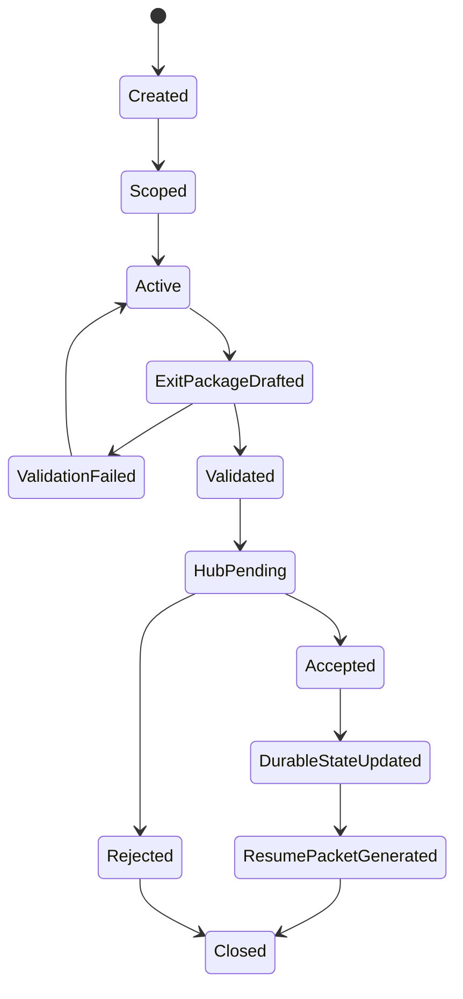
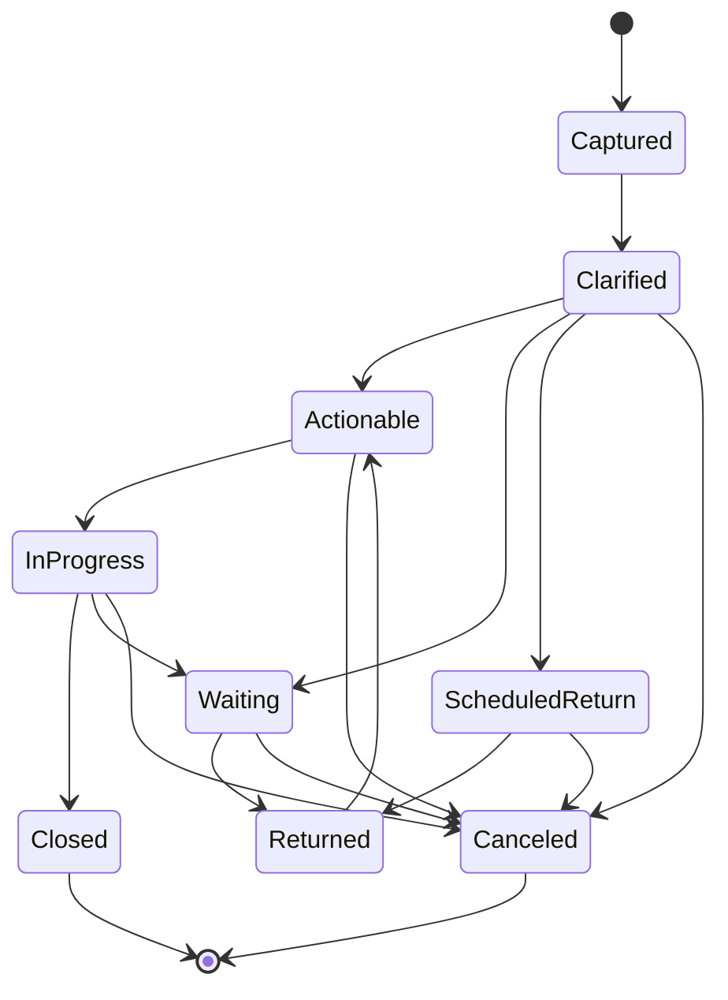
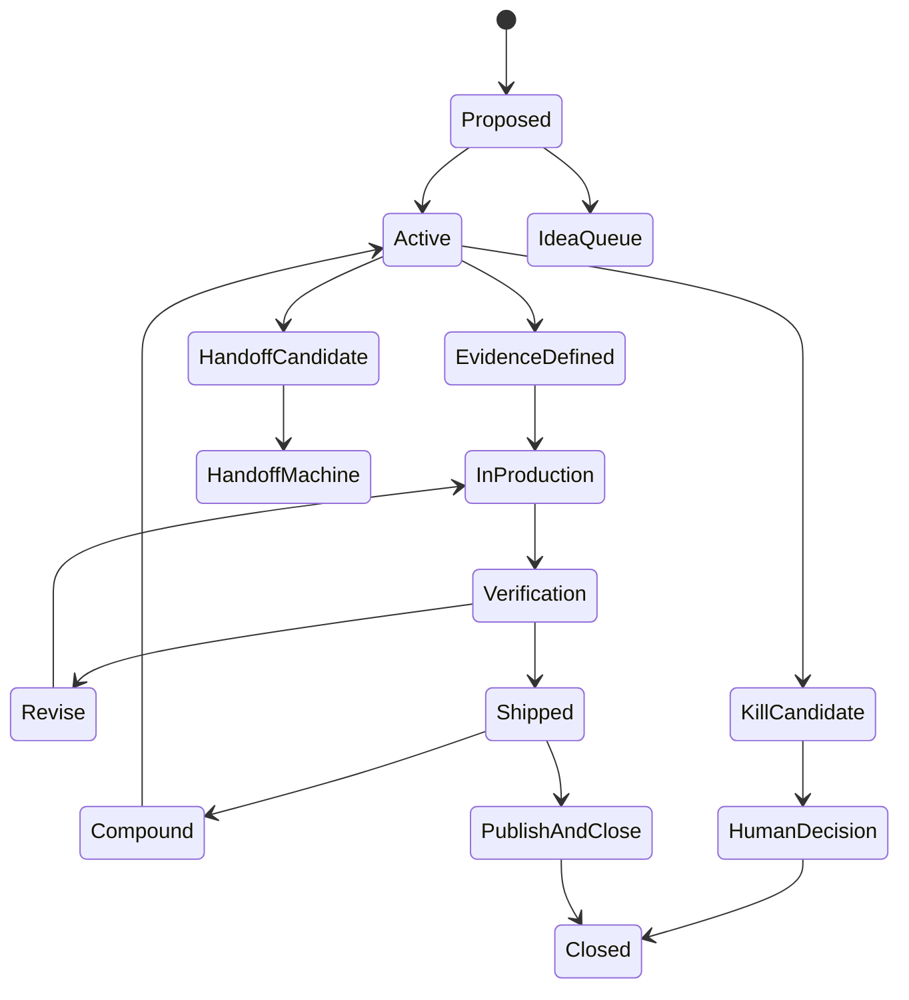
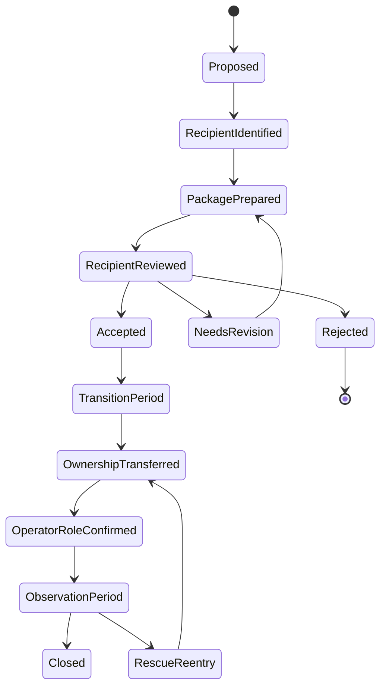
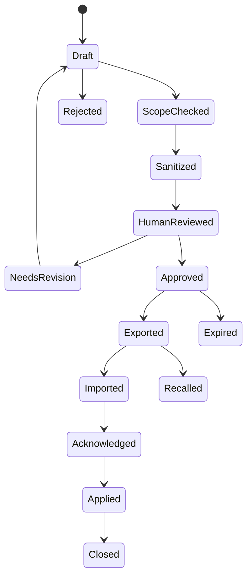
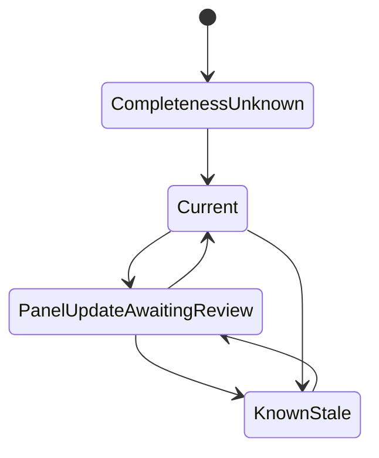
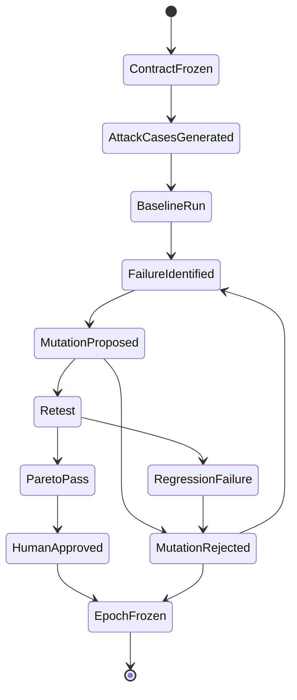

# ACE State Machines

## General invariant

Agents may propose transitions. Deterministic validation and required human approval record and enforce transitions.

## 1. Panel lifecycle

### Required transitions

- `Created -> Scoped`: objective, type, visible roots, limits, and output defined.
- `Active -> ExitPackageDrafted`: panel stop condition met.
- `ExitPackageDrafted -> Validated`: schema and source-scope checks pass.
- `Validated -> HubPending`: proposed changes become visible in Obsidian.
- `HubPending -> Accepted`: approval class satisfied.
- `Accepted -> DurableStateUpdated`: authoritative personal state updated.
- `DurableStateUpdated -> ResumePacketGenerated`: exact next session state prepared.

## 2. Commitment and return

*(Diagram includes the v1.1-proposed `Canceled` transitions — see the fix note below and Q-D2.)*

A commitment cannot enter `Closed` without closure evidence or explicit cancellation approval.

`ScheduledReturn` may include `no_action_before` to release the item from daily attention.

*(v1.1 fix)* The v1.0 yaml added a `Canceled` state reachable only from `Clarified`, not declared terminal — leaving in-flight commitments uncancelable. v1.1 makes `Canceled` **terminal**, reachable from `Clarified`, `Actionable`, `Waiting`, `ScheduledReturn`, and `InProgress`, always guarded by **explicit cancellation approval** (matching the prose rule above). *(Q-D2)*

## 3. Project and evidence lifecycle

A project is at risk when it remains active without a next evidence unit or shipment for the configured period.

## 4. Ownership handoff

*(Diagram includes the v1.1-proposed `Rejected` decline path — see the fix note below and Q-D2.)*

### Success conditions

- successor accepts;
- next milestone exists;
- recurring operator obligations are removed;
- retained role and rescue threshold are explicit;
- successor completes an independent milestone;
- no rescue re-entry occurs outside threshold.

### PROJECT-W example

`ActivePublicationPhase -> PublicationComplete -> ApprovedHandoffActivated -> OwnershipTransferred -> ObservationPeriod -> Closed` *(PROJECT-W: the canonical handoff-example project.)*

*(v1.1 fix)* The v1.0 yaml declared a terminal `Rejected` state with **no incoming transition** (unreachable), absent from this diagram. v1.1 proposes wiring `RecipientReviewed -> Rejected` (recipient declines the handoff outright, rather than looping through `NeedsRevision` forever). *(Q-D2)*

## 5. Cross-layer transfer

Export alone is not completion. The target layer must acknowledge receipt.

## 6. Obsidian synchronization state

The hub must never show `Current` when a newer validated package is pending.

## 7. Red-Queen epoch

*(Diagram includes the v1.1-proposed `MutationRejected` exits — see the fix note below and Q-D2.)*

Within an epoch, the evaluation contract cannot be changed to excuse a failure.

*(v1.1 fix)* In both v1.0 renderings, `MutationRejected` was a dead end — not terminal, no outgoing transition. v1.1 wires `MutationRejected -> FailureIdentified` (another mutation may be proposed while the ≤3-mutation budget lasts) and `MutationRejected -> EpochFrozen` (budget exhausted: the epoch closes without adopting a change). *(Q-D2)*

## Authority note *(v1.1)*

The **`.md` is authoritative for semantics** (guards, prose rules); `04_STATE_MACHINES.yaml` v1.1 is the machine-readable projection loops consume. The v1.0 yaml omitted machine 3 (project and evidence lifecycle) entirely and encoded no guards; v1.1 restores the machine and encodes every guard. Divergence between the two files is a validation error, not an interpretation choice. *(Q-D2 fixes APPROVED in the R2-2 sign-off, 2026-07-19 — the three fixes are in force.)*

---

### Change log

- **v1.1 (2026-07-19)** — carried from `reference materials/04_STATE_MACHINES.md` (not included in the public release); three state-machine bugs documented and fixed as PROPOSED (commitment `Canceled`, handoff `Rejected`, red-queen `MutationRejected` dead end), with the mermaid diagrams updated to render the proposed shape; authority note added. Yaml note: machine 3's `HandoffMachine` delegation state is kept, with an explicit `handoff_machine -> closed` edge encoding the .md prose (the v1.0 .md gave it no outgoing edge). Machine structure otherwise unchanged.
